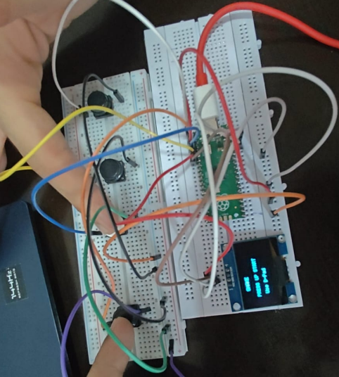
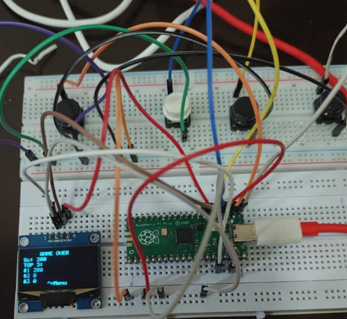

# RP2040 Embedded Game Engine / Framework

[](https://www.raspberrypi.com/documentation/microcontrollers/raspberry-pi-pico.html)
[](https://en.cppreference.com/)
[](LICENSE)

A deterministic, hardware-abstracted embedded game framework and application engine written in C for the **Raspberry Pi Pico (RP2040)**. The framework features interrupt-synchronized rendering scheduling, modular peripheral drivers, finite state machines, and real-time simulations running on an **SSD1306 OLED display**.

It currently ships with two complete game implementations that showcase the framework's capabilities:
1. **Snake**: A classic arcade game demonstrating coordinate collision verification and LCG food generation.
2. **Paradox Drift**: A space-dodging game featuring a custom **Time Echo** ring buffer replay engine.

---

## Media & Demonstration Gallery

### System Setup

| Real-Life Hardware Breadboard Setup | Virtual Wokwi Simulator Wiring Diagram |
| :---: | :---: |
|  |  |

### In-Game Screenshots (Wokwi Simulator)

| Game Start Menu | Active Gameplay | Game Over Screen |
| :---: | :---: | :---: |
|  |  |  |

### Physical Hardware Demos (IRL)

| Snake Gameplay | Snake Game Over | Paradox Drift Game Over |
| :---: | :---: | :---: |
|  |  |  |

---

## Technical Architecture

The architecture decouples the physical hardware layer from the high-level game logic using an abstract driver model.

```
       +-------------------------------------------------+
       |                Arcade Game FSMs                 |
       |         [ Snake ]       [ Paradox Drift ]       |
       +-----------------------+-------------------------+
                               | Links to Drivers
                               v
       +-----------------------+-------------------------+
       |             Common Driver Libraries             |
       |      [ common_display ]      [ common_input ]   |
       +-----------------------+-------------------------+
                               | Hardware Callbacks
                               v
       +-----------------------+-------------------------+
       |             Raspberry Pi Pico SDK               |
       |   [ I2C Controller ]   [ GPIO ]   [ Alarms ]    |
       +-------------------------------------------------+
```

### Engineering Highlights

- **Deterministic Update Scheduling**: Relies on a hardware alarm timer callback (`add_alarm_in_ms`) that fires every **100ms**. Critical sections (`critical_section_t`) ensure thread-safe operations during state updates.
- **Shared Peripheral Abstraction**: The graphics display (`common_display`) and inputs (`common_input`) are compiled as independent static libraries. This allows any game target to link with drivers out-of-the-box.
- **Universal Page Addressing**: The SSD1306 display driver uses direct page write cycles ($128 \times 64$ resolution framebuffer). This avoids page wrapping bugs common in basic display controllers.
- **Resource-Optimized Ring Buffer**: Features a low-memory snapshotting ring buffer to implement the "Time Echo" ghost-replay mechanic without overhead or dynamic memory allocations.

---

## Directory Structure

```
rp2040-embedded-game-engine/
├── CMakeLists.txt             # Root CMake config (defines common libs & projects)
├── pico_sdk_import.cmake      # Imports Raspberry Pi Pico SDK
├── LICENSE                    # MIT License
├── common/                    # Shared hardware drivers (Static Libraries)
│   ├── display/               # SSD1306 OLED display driver logic
│   └── input/                 # Active-low debounced button driver logic
├── snake/                     # Snake game module (Executable)
│   ├── src/ & include/        # LCG pseudorandom, collision, and state logic
│   └── diagram.json           # Wokwi simulator breadboard setup
├── paradox-drift/             # Paradox Drift game module (Executable)
│   ├── src/ & include/        # Ring buffer history, coordinates, and lasers
│   └── diagram.json           # Wokwi simulator breadboard setup
├── hardware/                  # Detailed schematics and pin connection tables
├── docs/                      # Portfolio architecture reports
└── images/                    # Demo screenshots and GIFs
```

---

## Wokwi Simulation

Both games are configured for browser-based simulation via Wokwi. This allows quick verification of the FSM states, custom OLED layouts, and active-low interrupt routines without physical hardware. Refer to the game subdirectories for simulator files (`diagram.json` and `wokwi.toml`).

---

## Hardware Configuration

Detailed schematics can be found in the [Hardware Wiring Guide](hardware/README.md).

* **Display**: SSD1306 1.3" OLED panel connected to Pico **GP4 (SDA)** and **GP5 (SCL)** via I2C0.
* **Controls**: Four tactile buttons connected to GPIO pins **GP0 (Right)**, **GP1 (Left)**, **GP2 (Up)**, and **GP3 (Down)**. Buttons use internal active-low pull-up configs.

## Pre-compiled Binaries (Quick Start)

If you have a physical RP2040 board and want to run the games immediately without setting up the compiler toolchain, you can download the pre-compiled `.uf2` binaries directly from the latest [GitHub Release](https://github.com/Saksham-239/rp2040-embedded-game-engine/releases):

* 🚀 **[Download snake.uf2](https://github.com/Saksham-239/rp2040-embedded-game-engine/releases/latest/download/snake.uf2)**
* 🚀 **[Download paradox-drift.uf2](https://github.com/Saksham-239/rp2040-embedded-game-engine/releases/latest/download/paradox-drift.uf2)**

#### Flashing Guide
1. Connect your Raspberry Pi Pico to your PC while holding the **BOOTSEL** button. The board will mount as a USB storage drive named `RPI-RP2`.
2. Drag and drop the downloaded `.uf2` file onto the drive. The board will automatically flash, reboot, and launch the game.

---

## Build & Flash Instructions

### Prerequisites
1. Install the **Raspberry Pi Pico SDK (v2.2.0)**.
2. Set your environment variables:
   ```powershell
   $env:PICO_SDK_PATH = "C:\Users\<user>\.pico-sdk\sdk\2.2.0"
   ```
3. Ensure **CMake**, **Ninja**, and the **GNU ARM Embedded Toolchain (`arm-none-eabi-gcc`)** are added to your system `PATH`.

### Compile
Compile the targets using CMake and Ninja:

```powershell
# Create build directory
mkdir build
cd build

# Configure and compile both targets
cmake -G Ninja ..
ninja
```

This compiles both games, generating flash-ready binaries:
* `build/snake/snake.uf2`
* `build/paradox-drift/paradox-drift.uf2`

### Flash to Target
1. Connect your Raspberry Pi Pico to your computer while holding the **BOOTSEL** button.
2. Mount the Pico as a mass storage drive (e.g. `R:\`).
3. Drag and drop the `.uf2` binary of choice (e.g. `snake.uf2`) onto the drive. The Pico will reboot automatically and run the program.
