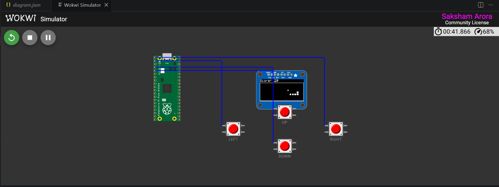
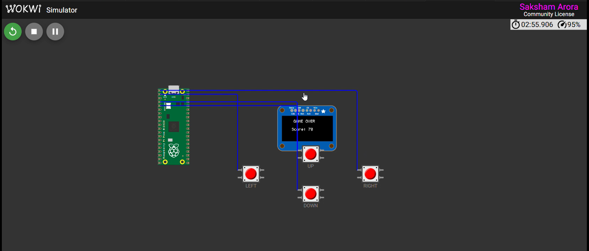
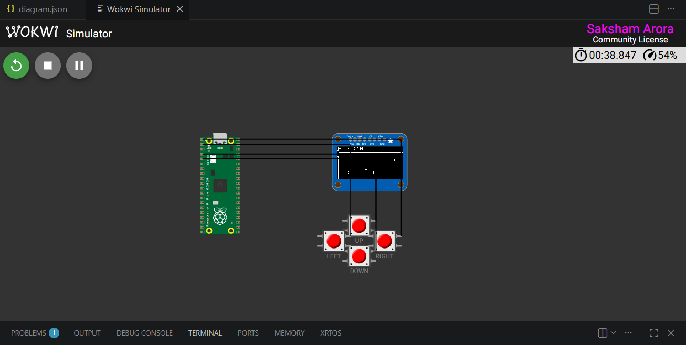
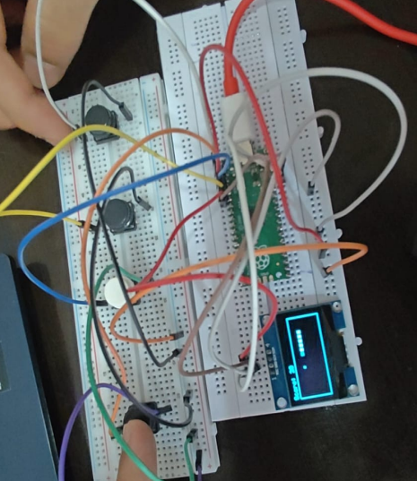
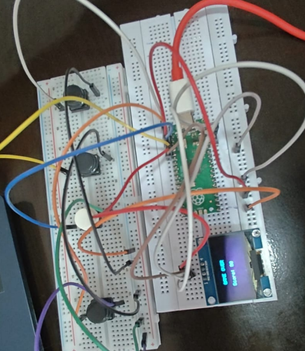

# Snake Game Module

This folder contains the **Snake Game** application designed to run on the RP2040 Embedded Game Engine. It showcases deterministic game loop execution, active-low interrupt handling, and custom OLED rendering algorithms on a resource-constrained hardware architecture.

---

## Architectural Breakdown

The game utilizes a state-machine design implemented in C, running at a deterministic update rate synchronized by a hardware alarm timer.

### Core Modules

1. **`src/main.c`**:
   - Manages the top-level FSM (`STATE_INIT`, `STATE_MENU`, `STATE_PLAYING`, `STATE_GAME_OVER`).
   - Registers a hardware alarm callback that triggers a game tick update every **100ms** via critical sections (`critical_section_t`).
2. **`src/snake_game.c`**:
   - Contains the core game state simulation.
   - Computes snake coordinates, handles food generation using a lightweight pseudorandom number generator (PRNG), and performs collision check evaluations.
3. **`include/snake_game.h`**:
   - Declares coordinates structures (`position_t`), main state models (`game_state_t`), and game-loop interface routines.

---

## Game Engine Mechanics

### Pseudorandom Coordinate Generator
Embedded architectures lack heavy system random pools. The engine implements a lightweight linear congruential generator (LCG) to generate food positions on the grid:

```c
static uint32_t random_state = 12345;
static uint32_t simple_rand(void) {
    random_state = (random_state * 1103515245 + 12345) & 0x7fffffff;
    return random_state;
}
```

### Collision & Bounds Wrap-around
To make play fair in a compact $16 \times 8$ grid space, coordinate wrapping is handled at grid margins:
- Head coordinate out-of-bounds wraps to the opposite border.
- Body overlap checks trigger immediate transition to `STATE_GAME_OVER`.

---

## Local Simulation

You can simulate this module directly in your browser using the provided Wokwi setup:
1. Ensure the project is compiled.
2. Open `diagram.json` in VS Code with the **Wokwi** extension.
3. Press **Start Simulation** to run the logic directly inside the virtual RP2040 emulator.

### Simulation Screenshots

| Start Menu | Active Gameplay | Game Over Screen |
| :---: | :---: | :---: |
|  |  |  |

### Physical Hardware Screenshots (IRL)

| Gameplay | Game Over (Normal) | Game Over (Alternative) |
| :---: | :---: | :---: |
|  |  |  |


